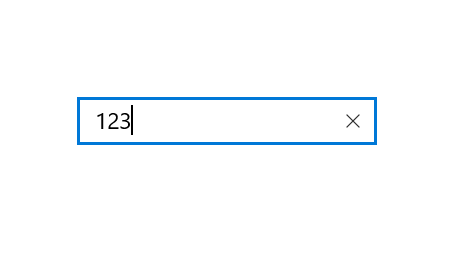

# How-to-disable-the-clear-button-in-numeric-textbox-in-Xamarin.Forms-UWP

This article explains how to disable the clear button in UWP SfNumericTextBox in Xamarin.Forms

The SfNumericTextBox control is an advanced version of the Entry control that restricts input to numeric values. Its cancel button to clear the entire value in numeric textbox area as shown

 

If you want to get rid of this cancel button, you can disable the cancel button using custom renderer and the output will be like this

 
 
## Creating the above UI

You can achieve the above UI using the below code snippet

[C#]

```
public class CustomNumericTextBox: SfNumericTextBox
{

}
```

[XAML]

```
<StackLayout>

        <local:CustomNumericTextBox Value="123" />

</StackLayout>
```

[CustomNumericTextBoxRenderer_UWP]

```
class CustomNumericTextBoxRenderer_UWP : SfNumericTextBoxRenderer
    {
        protected override void OnElementChanged(ElementChangedEventArgs<SfNumericTextBox> e)
        {
            base.OnElementChanged(e);
            if (Control != null)
            {
                Control.Loaded += Control_Loaded;
            }
        }

        private void Control_Loaded(object sender, Windows.UI.Xaml.RoutedEventArgs e)
        {

            FindChildControl<Button>(Control, "DeleteButton");
        }
        public DependencyObject FindChildControl<T>(DependencyObject control, string ctrlName)
        {
            int childNumber = VisualTreeHelper.GetChildrenCount(control);
            for (int i = 0; i < childNumber; i++)
            {
                DependencyObject child = VisualTreeHelper.GetChild(control, i);
                FrameworkElement FrameElement = child as FrameworkElement;
                if (FrameElement == null) return null;

                if ((FrameElement is Grid))
                {
                    UIElement FrameElementChild = (FrameElement as Grid).Children[1];
                    if (FrameElementChild is Grid)
                    {
                        UIElement CloseButton = (FrameElementChild as Grid).Children[6];
                        if ((CloseButton as Button).Name == ctrlName)
                        {
                            (CloseButton as Button).Width = 0;
                            (CloseButton as Button).Height = 0;
                        }
                    }
                    return child;
                }
                else
                {
                    DependencyObject nextLevel = FindChildControl<T>(child, ctrlName);
                    if (nextLevel != null)
                        return nextLevel;
                }
            }
            return null;
        }
    }
```    

## See also

[How to customize the colors in Xamarin.Forms SfNumericTextBox](https://help.syncfusion.com/xamarin/numeric-entry/colors)

[How to format the numeric value in Xamarin.Forms SfNumericTextBox](https://help.syncfusion.com/xamarin/numeric-entry/number-formatting)

[Available interaction in numeric control](https://help.syncfusion.com/xamarin/numeric-entry/events-and-interactivity)


